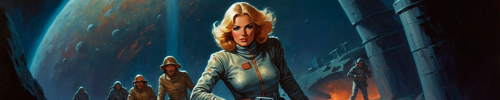
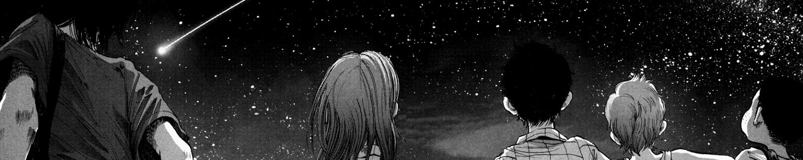
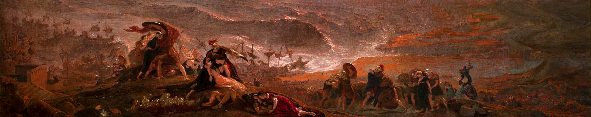
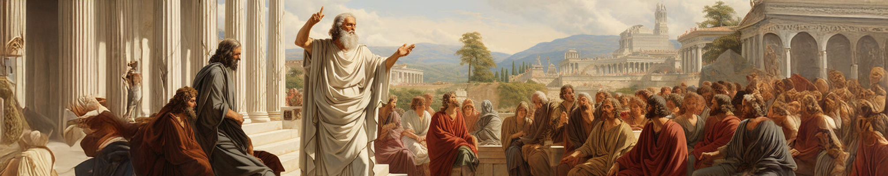

# Clubes 

- [Clubes](#clubes)
- [**Club de Ciencia Ficción y Fantasía**](#club-de-ciencia-ficción-y-fantasía)
- [**Club de Manga**](#club-de-manga)
- [**Club de Literatura Clásica**](#club-de-literatura-clásica)
- [**Club de Ensayos Filosóficos**](#club-de-ensayos-filosóficos)

----

# **Club de Ciencia Ficción y Fantasía**

**Bienvenidos al Club de Ciencia Ficción**

¿Te apasiona explorar futuros alternativos, viajes extraordinarios y mundos llenos de imaginación? Únete al Club de Ciencia Ficción, un espacio para los amantes de las grandes historias que desafían los límites de lo posible.

📚 En nuestras reuniones, leeremos y discutiremos obras clásicas y modernas de autores visionarios como *Julio Verne*, el maestro de los viajes increíbles; *George Orwell*, con sus inquietantes distopías; *Philip K. Dick*, creador de realidades alternativas que inspiran; y el incomparable arte narrativo de *Moebius*, entre muchos otros.

✨ Aquí encontrarás un lugar para compartir ideas, debatir temas profundos y conectar con otros exploradores de la ciencia ficción. ¡Prepárate para viajes únicos a través de la imaginación!

---

# **Club de Manga**  

¡Bienvenidos al **Club de Lectura de Manga!** 🌸✨

Este es un espacio creado para quienes disfrutan sumergirse en las fascinantes historias del manga. Nos dedicamos a leer, compartir y analizar obras que van desde los géneros más conocidos, como el shōnen, shōjo o seinen, hasta subgéneros específicos como el isekai, el yuri o el slice of life.

📚 ¿Qué hacemos?

* Exploramos tanto clásicos como One *Piece* o *Akira*, así como títulos menos conocidos que merecen nuestra atención.
* Compartimos ideas sobre el arte, la narrativa y los temas culturales reflejados en las historias.
* Nos aventuramos en diversos géneros, desde fantasía épica y romance hasta terror psicológico y comedia.

💬 ¿Por qué unirte?

Porque el manga es más que entretenimiento: es una ventana a mundos únicos y una forma de conectar con otros apasionados. ¡Te esperamos para compartir tus mangas favoritos y descubrir otros que te sorprenderán!

---

# **Club de Literatura Clásica**  

**¡Bienvenidos al Club de Literatura Clásica! 📜✨**

Este club está dedicado a explorar las grandes obras que han marcado la historia de nuestra literatura. Desde las epopeyas de Homero hasta las novelas de Jane Austen, aquí encontrarás un espacio para debatir y reflexionar sobre textos atemporales.

📚 Actividades del club:

* Lectura de clásicos como *La Ilíada*, *Orgullo y Prejuicio* y *Don Quijote de la Mancha*.
* Discusiones sobre el contexto histórico, cultural y literario.
* Encuentros para compartir ideas y perspectivas.

¡Redescubre los fundamentos de la literatura universal! 🌟

---

# **Club de Ensayos Filosóficos**

**¡Bienvenidos al Club de Ensayos Filosóficos! 📜**

Este club es el lugar ideal para quienes buscan profundizar en el pensamiento filosófico a través de ensayos que abordan temas como la ética, la política y la naturaleza humana. Cuestiones importantes para quienes buscan ir "más allá" de lo dictado por la sociedad.

📚 Lecturas destacadas:

* El contrato social de Rousseau.
* Meditaciones metafísicas de Descartes.
* Así habló Zaratustra de Nietzsche.
* El Elemento de Ken Robinson.

💡 ¿Por qué unirte? Porque la filosofía nos ayuda a comprender mejor lo complejo del mundo y nuestro lugar en él. Este espacio es perfecto para debatir y aprender con otros apasionados por el conocimiento.
